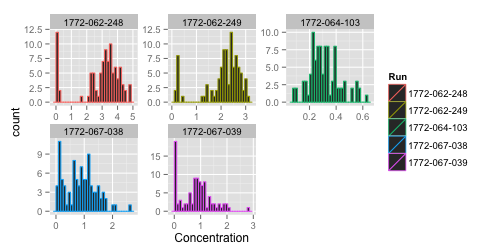
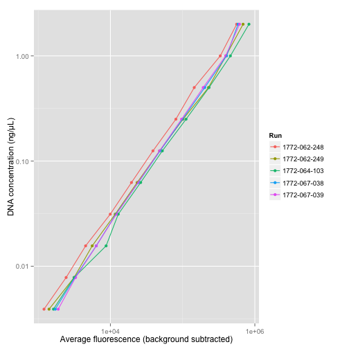

cDNA yield after C1 runs
========================

Summary
-------

This page shows where to retrieve the [data files](#datasets) containing the
measurement of DNA concentration in the 96-well plates after collection of the
cDNAs from the capture array.  It then presents some [commands](#functions) to
import the data in `R`, and uses them to produce a consolidated
[table](#output-format) for the five runs, that is [saved](#save-data) for
integrated analysis later.  Finally, some [quality controls](#qc) are run,
showing strong variation between runs for the DNA yield after the on-chip PCR.
An inspection of the [standard curves](#standard-curves) rules out that it
could be a simple problem of measurement.


Method
------

After a C1 run, the products are recovered from the outlets and transferred to a
96-well plate.  Following the standard procedure (PN 100-5950 A1, page 25),
2 μL are quantified on a 384-well fluorometer using the PicoGreen dye.  See
also _PicoGreen Quantitation of DNA: Effective Evaluation of Samples Pre-or
Post-PCR._ Susan J. Ahn, José Costa and Janet Rettig Emanuel, _Nucl. Acids
Res._ (1996) [24(13):2623-2625](http://dx.doi.org/10.1093/nar/24.13.2623).

The measured fluorescence intensities are transferred in an Excel sheet
provided by Fluidigm (PN 100-6160), which converts them to DNA concentrations
by linear regression to a standard curve.

The `R` commands here load the Excel sheets and produce one consolidated table
for all runs, on which a few quality controls are run.


<a name='datasets'>Datasets</a>
-------------------------------

Each file is named following the serial ID of the C1 chip from which DNA was collected.

The files are available from [GitHub]() and will be deposited in a proper place
later.  The files need to be downloaded before running this knitr script.


```bash
shasum -c << __CHECKSUMS__
6d58020277bd2eb42f5702eabe17194671d9e87f  1772-062-248.picogreen.xlsx
83844dd8e077d54a619e6bff396992b23d8a26e8  1772-062-249.picogreen.xlsx
656fb4bd93466cd4f005881a046f3f17c17f4a78  1772-064-103.picogreen.xlsx
f4e2064d7c09826a8ad14ed2a95a66255018da39  1772-067-038.picogreen.xlsx
c9a1ece68f037589d40b382f59d202dbb90425de  1772-067-039.picogreen.xlsx
__CHECKSUMS__
```

```
## 1772-062-248.picogreen.xlsx: OK
## 1772-062-249.picogreen.xlsx: OK
## 1772-064-103.picogreen.xlsx: OK
## 1772-067-038.picogreen.xlsx: OK
## 1772-067-039.picogreen.xlsx: OK
```


<a name='functions'>Functions to load the data in `R`</a>
---------------------------------------------------------


```r
library(gdata)
library(ggplot2)
library(reshape)
```

These files in _Excel_ format contain the final result in their third sheet,
from line 42 to 49.

First, extract the concentrations as a 8 × 12 table.  An example is shown for
run `1772-062-248`.


```r
readConcentrationTable <- function (FILE) {
  picogreen <- read.xls( FILE
                       , sheet =  3
                       , skip  = 41
                       , nrow  =  8
                       , head  = FALSE
                       , blank.lines.skip = FALSE )[,1:13]
  colnames(picogreen) <- c('Row', '01', '02', '03', '04', '05', '06', '07', '08', '09', '10', '11', '12')
  picogreen
}
readConcentrationTable('1772-062-248.picogreen.xlsx')
```

```
##   Row    01    02    03    04    05    06    07    08    09    10    11    12
## 1   A 3.743 0.173 2.832 3.739 4.200 4.485 2.444 0.091 4.404 0.046 1.672 4.781
## 2   B 3.099 3.935 3.927 2.192 3.958 0.101 0.243 2.229 0.099 4.557 3.287 4.028
## 3   C 4.190 0.095 2.545 4.009 3.756 3.064 3.155 0.116 4.217 2.505 0.138 3.847
## 4   D 4.760 4.299 3.198 3.174 3.756 2.657 0.108 3.170 4.209 3.512 0.116 2.908
## 5   E 4.742 3.243 2.339 0.120 2.254 3.498 3.248 3.178 3.168 4.259 3.808 3.854
## 6   F 4.244 3.083 3.152 0.122 2.352 3.339 3.384 3.242 3.475 2.524 2.958 2.430
## 7   G 3.408 3.632 2.969 3.526 2.978 3.613 2.921 3.599 3.392 3.799 2.321 3.361
## 8   H 3.370 3.506 3.152 3.402 3.604 0.115 3.995 4.319 3.568 3.079 2.375 3.622
```

Then, transform this table to have one measurement by line, with the run ID,
and the row and column name.  This is a typical format when plotting data with
_[ggplot2](http://ggplot2.org/)_.


```r
meltConcentrationTable <- function (RUN, TABLE) {
  picogreen <- melt(TABLE, id.vars='Row')
  colnames(picogreen) <- c('Row', 'Column', 'Concentration')
  picogreen[,"Run"] <- RUN
  picogreen[,"Well"] <- paste(picogreen$Row, picogreen$Column, sep='')
  picogreen <- picogreen[, c('Run', 'Well', 'Row', 'Column', 'Concentration')]
  picogreen
}
```

The function below outputs the data for one run, provided that a properly named
file (run ID plus `picogreen.xlsx`) is available in the same directory.


```r
read_pg <- function(RUN) {
  FILE <- paste(RUN, 'picogreen.xlsx', sep='.')
  picogreen <- readConcentrationTable(FILE)
  picogreen <- meltConcentrationTable(RUN, picogreen)
  picogreen
}
head(read_pg('1772-062-248'))
```

```
##            Run Well Row Column Concentration
## 1 1772-062-248  A01   A     01         3.743
## 2 1772-062-248  B01   B     01         3.099
## 3 1772-062-248  C01   C     01         4.190
## 4 1772-062-248  D01   D     01         4.760
## 5 1772-062-248  E01   E     01         4.742
## 6 1772-062-248  F01   F     01         4.244
```

The standard curve is also in sheet 3, from row 2 to 12.  Here is a function to
get the standard curve from one run (with background correction already
applied).  The output is self-explanatory.


```r
read_sc <- function(RUN) {
  FILE <- paste(RUN, "picogreen.xlsx", sep = ".")
  sc <- read.xls(FILE, sheet=3, skip=2, nrow=10, header=FALSE)[,c(2,5)]
  sc <- cbind(RUN, sc)
  colnames(sc) <- c('Run', 'dna', 'fluorescence')
  sc$fluorescence <- as.numeric(as.character(sc$fluorescence))
  return(sc)
}
read_sc('1772-062-248')
```

```
##             Run        dna fluorescence
## 1  1772-062-248 2.00000000     560415.0
## 2  1772-062-248 1.00000000     332109.0
## 3  1772-062-248 0.50000000     144873.0
## 4  1772-062-248 0.25000000      80629.5
## 5  1772-062-248 0.12500000      38842.0
## 6  1772-062-248 0.06250000      19577.0
## 7  1772-062-248 0.03125000       9952.0
## 8  1772-062-248 0.01562500       4536.5
## 9  1772-062-248 0.00781250       2437.0
## 10 1772-062-248 0.00390625       1204.0
```

<a name="output-format">Consolidated file (format)</a>
------------------------------------------------------

The file `cDNA_concentration.csv` is made from the files above using `R`, and has
the following columns.

### `Run`

The serial ID of the C1 capture array for a given run.  Example: `1772-062-248`.

### `Well`

The coordinates in the 96-well plate where the cDNAs have been transferred at
the end of the C1 run. Examples: `A01`, `F08`, `C12`, etc.  Combined with the
run ID, this uniquely identifies a cell.

### `Row`

The row coordinates in the 96-well plate where the cDNAs have been transferred
at the end of the run.  Possible values: `A`, `B`, `C`, `D`, `E`, `F`, `G` and
`H`.

### `Column`

The column coordinates in the 96-well plate where the cDNAs have been
transferred at the end of the run.  Possible values: `01`, `02`, `03`, `04`,
`05`, `06`, `07`, `08`, `09`, `10`, `11` and `12`.

### `Concentration`

The DNA concentration in ng/μL.


<a name="save-data">Consolidated file (preparation)</a>
-------------------------------------------------------

Each Excel sheet is loaded in `R`, the DNA concentrations are extracted, and
added to a table saved under the name `cDNA_concentration.csv`.

The `cDNA_concentration.csv` file contains the data for the following runs.


```r
RUNS <- c('1772-062-248', '1772-062-249', '1772-064-103', '1772-067-038', '1772-067-039')
```

Create a `picogreen` table for the first run being processed, append the other
runs, and save the file.


```r
for (RUN in RUNS) {
  if (! exists('picogreen'))
    {picogreen <- read_pg(RUN)}
  else
    {picogreen <- rbind(picogreen, read_pg(RUN))}
}

summary(picogreen)
```

```
##      Run                Well                Row          Column    Concentration   
##  Length:480         Length:480         A      : 60   01     : 40   Min.   :0.0040  
##  Class :character   Class :character   B      : 60   02     : 40   1st Qu.:0.3125  
##  Mode  :character   Mode  :character   C      : 60   03     : 40   Median :1.0120  
##                                        D      : 60   04     : 40   Mean   :1.4048  
##                                        E      : 60   05     : 40   3rd Qu.:2.3750  
##                                        F      : 60   06     : 40   Max.   :4.7810  
##                                        (Other):120   (Other):240
```

```r
write.csv(file='cDNA_concentration.csv', picogreen, row.names=FALSE)
```

<a name='qc'>Quality control</a>
--------------------------------

There is a strong variation between runs.


```r
qplot( data=picogreen
     , Run
     , Concentration
     , geom="boxplot"      
#     , ylab="cDNA concentration (ng/\u03BCL)"
     , fill=Run) + 
       coord_flip() + theme_bw() +
       theme(axis.title = element_text(size=14, family="Helvetica"),
             axis.text = element_text(size=8, family="Helvetica"),
             legend.title = element_text(size=12, family="Helvetica")) +
       scale_x_discrete(limits=rev(levels(as.factor(picogreen$Run))))
```

 

Still, for most runs except _1772-064-103_, it is possible to detect
low-concentration outliers, were there probably was no cell in the chamber.
Note that the scale of each histogram is different.


```r
qplot( data=picogreen
     , Concentration
     , geom="histogram"
#     , xlab="Concentration (ng/\u03BCL)"
     , colour=Run) + 
       facet_wrap( ~Run, scales='free')
```

 

<a name='standard-curves'>Comparison between standard curves</a>
----------------------------------------------------------------

Load the data from all runs.


```r
for (RUN in RUNS) {
    if (!exists("sc")) {
        sc <- read_sc(RUN)
    } else {
        sc <- rbind(sc, read_sc(RUN))
    }
}
```

While the DNA concentrations in `1772-062-248` might have been overestimated
as suggested by the shifted standard curve, overall the calibration of the
fluorometer is stable and does not explain the strong variations of the DNA
yield. 


```r
ggplot(
  sc,
  aes(
    x=fluorescence,
    y=dna,
    colour=Run)
) + geom_point() +
    geom_line() + 
    scale_x_log10('Average fluorescence (background subtracted)') +
    scale_y_log10('DNA concentration (ng/\u03BCL)')
```

 

Session Info
------------


```r
sessionInfo()
```

```
## R version 3.1.0 (2014-04-10)
## Platform: x86_64-apple-darwin13.1.0 (64-bit)
## 
## locale:
## [1] C
## 
## attached base packages:
## [1] methods   stats     graphics  grDevices utils     datasets  base     
## 
## other attached packages:
## [1] reshape_0.8.5 ggplot2_1.0.0 gdata_2.13.3 
## 
## loaded via a namespace (and not attached):
##  [1] MASS_7.3-35      Rcpp_0.11.3      colorspace_1.2-4 digest_0.6.6     evaluate_0.5.5   formatR_1.0     
##  [7] grid_3.1.0       gtable_0.1.2     gtools_3.4.1     knitr_1.8        labeling_0.3     munsell_0.4.2   
## [13] plyr_1.8.1       proto_0.3-10     reshape2_1.4.1   scales_0.2.4     stringr_0.6.2    tools_3.1.0
```
